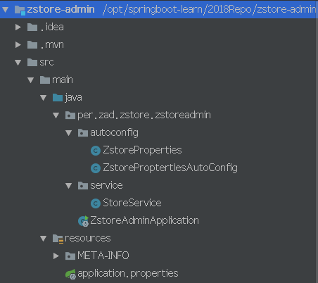

代码路径：https://github.com/XiaoDongZhi/2018Repo/tree/master/zstore-admin

简单解读备忘：   
      
一、先看pom.xml
      
```xml
<?xml version="1.0" encoding="UTF-8"?>
<project xmlns="http://maven.apache.org/POM/4.0.0" xmlns:xsi="http://www.w3.org/2001/XMLSchema-instance"
         xsi:schemaLocation="http://maven.apache.org/POM/4.0.0 http://maven.apache.org/xsd/maven-4.0.0.xsd">
    <modelVersion>4.0.0</modelVersion>

    <!--
    springboot需要继承org.springframework.boot；
    -->
    <parent>
        <groupId>org.springframework.boot</groupId>
        <artifactId>spring-boot-starter-parent</artifactId>
        <version>2.1.1.RELEASE</version>
        <relativePath/> <!-- lookup parent from repository -->
    </parent>
    <groupId>per.zad.zstore</groupId>
    <artifactId>zstore-admin</artifactId>
    <version>0.0.1-SNAPSHOT</version>
    <name>zstore-admin</name>
    <description>Demo project for Spring Boot</description>

    <properties>
        <project.build.sourceEncoding>UTF-8</project.build.sourceEncoding>
        <project.reporting.outputEncoding>UTF-8</project.reporting.outputEncoding>
        <java.version>1.8</java.version>
        <spring-boot-admin.version>2.1.1</spring-boot-admin.version>
    </properties>

    <dependencies>
        <dependency>
            <groupId>de.codecentric</groupId>
            <artifactId>spring-boot-admin-starter-server</artifactId>
        </dependency>

        <dependency>
            <groupId>org.springframework.boot</groupId>
            <artifactId>spring-boot-starter-test</artifactId>
            <scope>test</scope>
        </dependency>

        <dependency>
            <groupId>org.springframework.boot</groupId>
            <artifactId>spring-boot-starter</artifactId>
        </dependency>

        <dependency>
            <groupId>org.springframework.boot</groupId>
            <artifactId>spring-boot-starter-web</artifactId>
        </dependency>

        <dependency>
            <groupId>org.springframework.boot</groupId>
            <artifactId>spring-boot-autoconfigure</artifactId>
            <version>2.1.1.RELEASE</version>
        </dependency>

    </dependencies>

    <dependencyManagement>
        <dependencies>
            <dependency>
                <groupId>de.codecentric</groupId>
                <artifactId>spring-boot-admin-dependencies</artifactId>
                <version>${spring-boot-admin.version}</version>
                <type>pom</type>
                <scope>import</scope>
            </dependency>
        </dependencies>
    </dependencyManagement>

    <!-- 
    Springboot的打包plugin,打出可执行的jar
    -->
    <build>
        <plugins>
            <plugin>
                <groupId>org.springframework.boot</groupId>
                <artifactId>spring-boot-maven-plugin</artifactId>
            </plugin>
        </plugins>
    </build>

</project>

```

二、看下项目工程

java代码包：
ZstoreAdminApplication.java:
代码如下，主要干两个事情，main class以及Controller：
1、Controller:作为RestAPI资源层，声明API的URI和实现
2、Main Application:Springboot的Main Application，启动Springboot应用   
```java
package per.zad.zstore.zstoreadmin;
import org.springframework.beans.factory.annotation.Autowired;
import org.springframework.boot.SpringApplication;
import org.springframework.boot.autoconfigure.SpringBootApplication;
import per.zad.zstore.zstoreadmin.service.StoreService;

import org.springframework.web.bind.annotation.RequestMapping;
import org.springframework.web.bind.annotation.RestController;

@SpringBootApplication
@RestController
public class ZstoreAdminApplication {
    @Autowired
    private StoreService storeService;

    @RequestMapping("/")
    public String index(){
        return storeService.saleItem();
    }
    public static void main(String[] args) {
        SpringApplication.run(ZstoreAdminApplication.class, args);
    }

}
```   
是springboot的Application，按照spring的建议，在项目代码根目录创建Main Application class       
类上主要两个注解   
@SpringBootApplication声明主类   
@RestController生命下该类具备RestAPI能力，对应类内的方法有@RequestMapping("/")，即RestAPI的URI路径；   
类内属性@Autowired，表示绑定属性   

Springboot的main Class的main方法中使用SpringApplication.run本Application；    


ZstoreProptertiesAutoConfig.java   
作为springboot的autoconfig能力，主要通过注解声明要将applicaition.properties中的以"phone"为前缀的kv注入到ZstoreProperties类中；
```java
package per.zad.zstore.zstoreadmin.autoconfig;

import org.springframework.beans.factory.annotation.Autowired;
import org.springframework.boot.autoconfigure.condition.ConditionalOnClass;
import org.springframework.boot.autoconfigure.condition.ConditionalOnProperty;
import org.springframework.boot.context.properties.EnableConfigurationProperties;
import org.springframework.context.annotation.Configuration;
import per.zad.zstore.zstoreadmin.service.StoreService;
import org.springframework.context.annotation.Bean;
import org.springframework.boot.autoconfigure.condition.ConditionalOnMissingBean;


@Configuration
@EnableConfigurationProperties(ZstoreProperties.class)
@ConditionalOnClass(StoreService.class)
@ConditionalOnProperty(prefix = "phone",value = "huawei",matchIfMissing = true)
public class ZstoreProptertiesAutoConfig {
    @Autowired
    private ZstoreProperties zstoreProperties;

    @Bean
    @ConditionalOnMissingBean
    public StoreService storeService() {
        StoreService storeService = new StoreService();
        storeService.setItem(zstoreProperties.getItem());
        return storeService;
    }

}
```   

ZstoreProperties.java
如下定义prefix="phone",类中定义属性item，那么springboot启动的时候会将application.properties中的phone.item注入到改类里面    

```java
package per.zad.zstore.zstoreadmin.autoconfig;

import org.springframework.boot.context.properties.ConfigurationProperties;

@ConfigurationProperties(prefix = "phone")
public class ZstoreProperties {

    // 默认的配置的值
    private final static String ITEM = "iphone";

    // 由于在configuationProperties中配置了前缀，所以可以在application.properties中使用phone.item配置该值，如果application.proterties里面没有配置，
    //则使用ITEM默认值"iphone"
    private String item = ITEM;

    // 这里的get和set方法，是方便外部注入参数值用的，需要注意的是这里和StoreService不同，并没有让properties中的参数直接注入到StoreService中
    public String getItem() {
        return item;
    }

    public void setItem(String item) {
        this.item = item;
    }
}

```  


StoreService.java
store的service，实现saleItem方法，提供给controller使用；
```java
package per.zad.zstore.zstoreadmin.service;

public class StoreService{
    private String item;

    public String saleItem() {
        return "hello " + item;
    }

    public String getItem() {
        return item;
    }

    public void setItem(String item) {
        this.item = item;
    }
}
```

resources/application.properties
```properties
phone.item="zte"
```

验证：
1、mvn package打包

2、java -jar zstore-admin-0.0.1-SNAPSHOT.jar
3、浏览器验证下：

